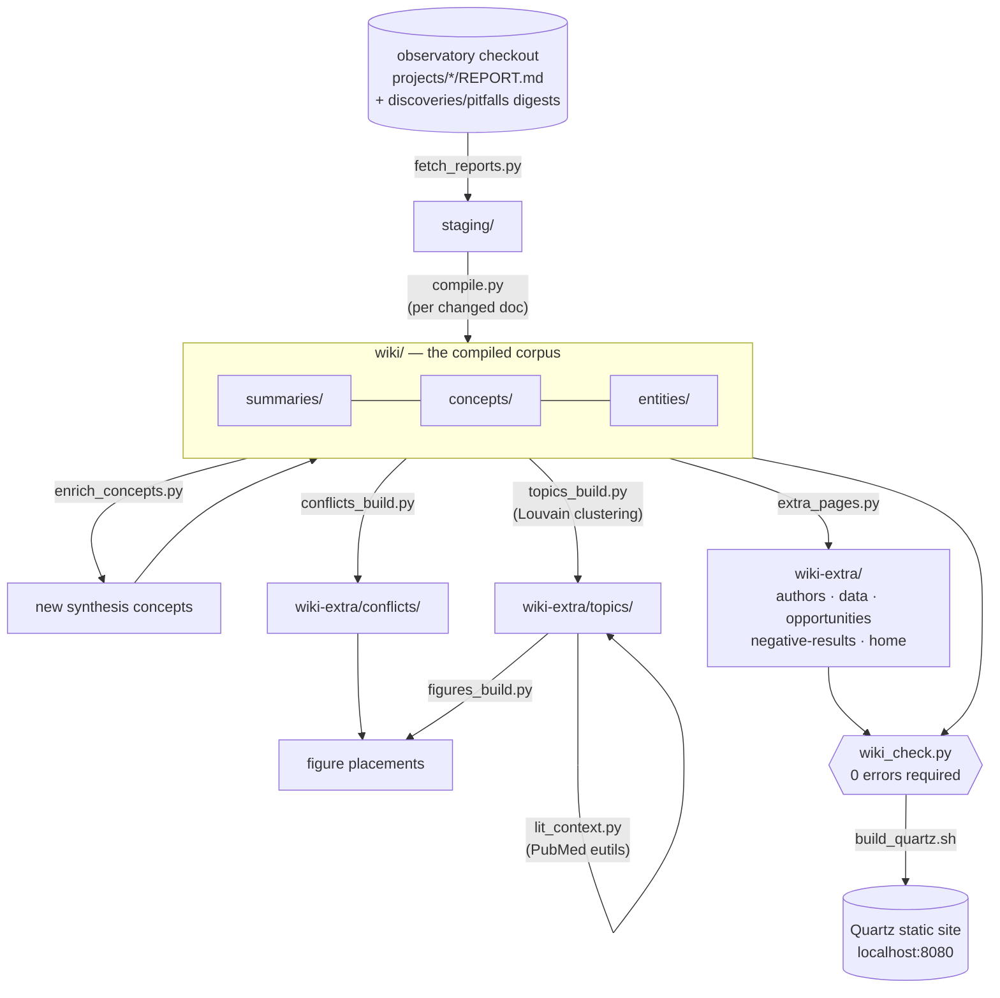
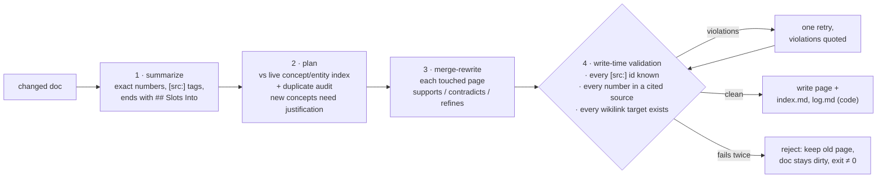

# Pipeline architecture

One command — `pipeline/run_pipeline.sh` — runs the whole workflow, bootstrap
and incremental alike. Every stage is a plain Python script, hash-cached and
idempotent: a stage whose inputs are unchanged is a no-op, so re-running the
pipeline on an unchanged corpus costs $0, and an interrupted run resumes
where it stopped.

## Stages

| Stage | Script | What it does | State cache |
|---|---|---|---|
| fetch | `fetch_reports.py` | sync `REPORT.md` per project + digests into `staging/`; backend-switchable (local checkout now, BERIL hub later) | — |
| compile | `compile.py` | per changed doc: summarize → plan against the live concept/entity index → merge-rewrite each touched page | `state/hashes.json` |
| enrich | `enrich_concepts.py` | per summary: audit the concept layer for *missing* synthesis concepts; justified creates only | `state/enrich.json` |
| conflicts | `conflicts_build.py` | promote multi-project `## Tensions` to conflict pages (Evidence Sides / Resolving Work) | in-page hash |
| hubs | `topics_build.py` | Louvain-cluster the concept graph; one narrative hub per topic + the home page | `state/topics-state.json` |
| literature | `lit_context.py` | splice a PMID-verified literature review under each hub's lead (see below) | `state/litcontext.json` |
| figures | `figures_build.py` | choose flagship report figures for summary/hub/conflict pages | `state/figures-*.json` |
| extras | `extra_pages.py` | deterministic pages: authors, data collections, Research Opportunities, Negative Results | — (pure code) |
| check | `wiki_check.py` | citation, numeric-fidelity, uptake, and duplicate-concept audits; **errors block publish** | — |
| publish | `build_quartz.sh` | Quartz v5 site build (see [publish-time transforms](wiki.md#publish-time-transforms)) | — |

## The compile loop (accumulate-by-rewrite)

Write-time validation is the core design difference from the previous
(OpenKB-based) generation: a page that cites an unknown source, invents a
number, or links a nonexistent page is never written. A rejected page leaves
its document "dirty", so the next run retries exactly the missing pieces
(pages whose frontmatter already lists the doc's summary are resume-skipped).

## Literature context

Each topic hub opens with a `## Literature Context` review placing the
corpus's findings against published work: the model proposes PubMed queries,
NCBI eutils fetches candidate papers, the model writes the review citing
**only** those candidates, and code verifies every cited PMID against the
fetched set — a fabricated reference cannot ship. Hub regeneration
automatically invalidates and rebuilds its review (the cache hashes the page
*without* the review section).

## Models and cost control

- All stages default to `gpt-5.6-luna` (draft-stage decision); `WIKI_MODEL`
  flips every stage at once, `COMPILE_MODEL` overrides compile alone.
- A budget tripwire aborts any run whose estimated spend exceeds
  `COMPILE_BUDGET_USD` (default $5), priced by `COMPILE_PRICE_IN/OUT`
  ($/token, defaults follow the default model). Interrupted runs resume.
- The editorial rulebook (`contract/AGENTS.md`) is injected into every LLM
  call and is runtime-editable without code changes.

## Where the data lives

| What | Where | Committed here? |
|---|---|---|
| Source reports (`REPORT.md` + digests) | `wiki/sources/` (in-corpus copy) and the [observatory repo](https://github.com/beril-doe/BERIL-research-observatory) (`projects/<id>/REPORT.md`, source of truth) | **yes** — a fresh clone can render raw reports and run every check |
| Compiled wiki + navigation layer | `wiki/`, `wiki-extra/` | yes |
| Stage caches | `state/*.json` | yes |
| Figures (binary images) | observatory repo, `projects/<id>/figures/` | no — spliced at publish when `BERIL_CHECKOUT` points at a clone; omitted otherwise |
| Underlying analysis data | KBase BER Data Lakehouse (queried by the original projects) | no — the wiki compiles reports, not raw data |
| `staging/` | derived scratch (fetch output) | no |

So: viewing and verifying the wiki needs only this repo; recompiling or
rendering figures needs a checkout of the observatory repo
(`BERIL_CHECKOUT=/path/to/BERIL-research-observatory`, default
`../BERIL-research-observatory`-style local path).

## Adding new content

Drop a new `projects/<id>/REPORT.md` into the observatory checkout and run
`./pipeline/run_pipeline.sh`. Fetch stages it, compile integrates it
(unchanged docs are hash-skipped), enrichment considers new concepts, and
only the hubs/conflicts/figures whose inputs changed regenerate. There is no
separate bootstrap mode — the first run and the five-hundredth are the same
command.
