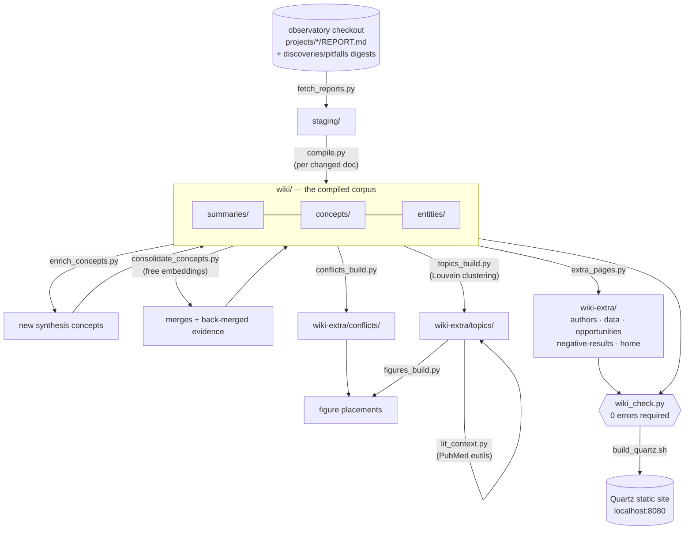
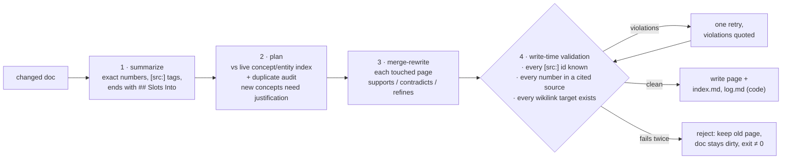

# Pipeline architecture

One command — `pipeline/run_pipeline.sh` — runs the whole workflow, bootstrap
and incremental alike. Every stage is a plain Python script, hash-cached and
idempotent: a stage whose inputs are unchanged is a no-op, so re-running the
pipeline on an unchanged corpus costs $0, and an interrupted run resumes
where it stopped.

## Stages

| Stage | Script | What it does | State cache |
|---|---|---|---|
| fetch | `fetch_reports.py` | sync `REPORT.md` per project + digests into `staging/`; backend-switchable (local checkout now, BERIL hub later) | — |
| compile | `compile.py` | per changed doc: summarize → plan against the live concept/entity index → merge-rewrite each touched page | `state/hashes.json` |
| enrich | `enrich_concepts.py` | per summary: audit the concept layer for *missing* synthesis concepts; justified creates only | `state/enrich.json` |
| consolidate | `consolidate_concepts.py` | embedding-ranked candidates: merge near-duplicate concepts, back-merge evidence into thin ones (see below) | `state/consolidate.json` |
| conflicts | `conflicts_build.py` | promote multi-project `## Tensions` to conflict pages (Evidence Sides / Resolving Work); folds together groups describing one disagreement, retires groups that disappear | in-page hash |
| hubs | `topics_build.py` | Louvain-cluster the concept graph; one narrative hub per topic + the home page | `state/topics-state.json` |
| literature | `lit_context.py` | splice a PMID-verified literature review under each hub's lead (see below) | `state/litcontext.json` |
| figures | `figures_build.py` | choose flagship report figures for summary/hub/conflict pages | `state/figures-*.json` |
| extras | `extra_pages.py` | deterministic pages: authors, data collections, Research Opportunities, Negative Results | — (pure code) |
| check | `wiki_check.py` | citation, numeric-fidelity, dead-link, uptake and duplicate-concept audits over all five publishable collections; **errors block publish**; `--strict` promotes numeric and link warnings to errors | — |
| publish | `build_quartz.sh` | Quartz v5 site build (see [publish-time transforms](wiki.md#publish-time-transforms)) | — |

## The compile loop (accumulate-by-rewrite)

Write-time validation is the core design difference from the previous
(OpenKB-based) generation: a page that cites an unknown source, invents a
number, or links a nonexistent page is never written. A rejected page leaves
its document "dirty", so the next run retries exactly the missing pieces
(pages whose frontmatter already lists the doc's summary are resume-skipped).

## Concept consolidation

Enrichment creates concepts one document at a time and hardcodes a one-element
`sources` list, while compile only merges a document into pages when *that*
document changes — so a concept created from document #60 is never revisited
against documents #1–59. Consolidation closes that loop.

Candidates are ranked by cosine similarity over embeddings of every concept and
summary (`lbl/nomic-embed-text`, free, plus `cohere-embed-v4` at ~$0.04 a pass; nothing
is cached). **Batches are kept to 8-32**: the gateway intermittently returns
duplicated embedding rows at a stride of 16 for large batches, giving unrelated
pages byte-identical vectors and silently destroying recall. `embed()` detects
collisions, re-embeds the affected rows individually, and aborts if more than a
handful survive that repair; a small residue is tolerated and logged, because a
copied vector only costs that page its ranking and the judge gates any false
pair it produces. This replaces the name-token
heuristic in `wiki_check.duplicate_concepts`, which needs ≥50% source-set
Jaccard and so cannot see duplicates among single-source pages. Then:

- **merge** — candidates come from three generators, judged most-precise first:
  pages that restate the same **figures** (shared cited project, ≥3 identical
  numbers, numeric Jaccard ≥ 0.5); pages built from the same **evidence base**
  (two pages whose cited-project sets are **identical** — 159 pairs of 11,628 at
  the pre-consolidation revision, and the structural signature of enrichment
  splitting one summary into several concepts. Equality, not containment:
  containment fires on nearly every shard/hub pair once the corpus is mostly
  multi-source, 128 candidates against 8); and finally the union
  of each embedding model's top-`--merge-topn` pairs as a recall net for
  cross-source paraphrase. Two embedding models are used because one alone has
  recall holes, and selection is by rank per model, since cosine ranges are not
  comparable across models. The
  judge is shown each page's *cited projects* and their overlap, because the
  decisive question is whether two pages rest on the same evidence, not whether
  they are framed differently. Pairs where both sides are already mature
  (`--min-sources` cited projects) are skipped: absorbing a shard into a hub is
  in scope, collapsing two mature hubs is not. A merge is one merge-rewrite of
  the survivor through `compile.generate_page`, the loser deleted and its inbound
  wikilinks repointed in code.
- **back-merge** — thin concepts are offered their top-`--topk` most similar
  summaries through compile's existing `CONCEPT_UPDATE_USER` rewrite.

Three invariants, all deterministic and all enforced after the model replies:
no `[src:]` id present in an input may be missing from the output; **no figure
present in an input may be missing either** — a rewrite can otherwise delete
whole measurements while keeping one citation tag, which is how a merge once
dropped 16 of a page's 97 numbers with every gate passing; and `sources`
frontmatter may only grow alongside a real `[src:]` citation in the prose. The
first two get one retry quoting what was lost, then the merge is abandoned and
both pages kept. The second one matters — the
previous-generation corpus *looked* multi-source but padded frontmatter with bare
"See also" links on 60 of its 81 concept pages. The metric is distinct `[src:]`
ids in the body; a rewrite that merely name-drops a project is discarded whole,
and the prompt offers an explicit `UNCHANGED` reply for the common case where a
similar-looking document has nothing to add.

`--dry-run` ranks and prints both candidate lists for $0 — no LLM calls, no
writes, free embedding models only. Use it to pick thresholds before spending.

## Forcing a rebuild

Content hashes cannot see a change to a stage's prompt or grouping rule, so
`./pipeline/run_pipeline.sh --force` rebuilds every derived stage instead of
trusting its cache (`conflicts_build`, `topics_build`, `lit_context` and
`figures_build` each take `--force` individually too). Reach for that rather
than deleting `state/*.json` or generated pages by hand: a rebuild anyone can
reproduce is the point, and hand-deletion leaves no record of what was rebuilt
or why. `topics_build --force` deliberately keeps its topic-name cache so page
slugs do not churn.

## Consolidation applies to concepts and conflicts, and only there

Duplication is possible only where an LLM decides how many pages to make.

- **concepts** — one page per idea, so the same idea can be written twice. This
  is what `consolidate_concepts.py` fixes.
- **conflicts** — grouped by their exact project set, so one disagreement
  reaching two different sets became two pages. `conflicts_build` now folds
  groups together when they share a project AND either restate the same figures
  or read near-identically (cosine ≥ `CONFLICT_SIM`, default 0.93 — above the
  99th percentile of 0.900, because these pages share a template and the median
  unrelated pair already sits at 0.79).
- **topics** — Louvain returns a partition, so clusters are disjoint by
  construction and stale hubs are reaped. Duplication is impossible.
- **summaries, authors, data** — one page per input. Impossible.
- **entities** — duplication is possible, but the concept detectors do NOT
  transfer and must not be reused here. Entity pages describing the same *kind*
  of thing read alike: the highest-scoring pair in the corpus, `aciad2176` and
  `aciad3137` at cosine 0.971, is two different genes, as is `pmoa`/`pmob` at
  0.941. Numeric overlap is equally misleading, scoring `cyanobacteriia` against
  `photosystem-ii` at 1.00 because they are co-mentioned in one passage. Entities
  need identity resolution (canonical name, aliases, external ids), and the ids
  `contract/AGENTS.md` requires are recorded on only ~40 of 336 pages. Left as
  its own piece of work; the observed duplicate rate is low and 197 of 336
  entity pages are hidden at publish anyway.

## Literature context

Each topic hub opens with a `## Literature Context` review placing the
corpus's findings against published work: the model proposes PubMed queries,
NCBI eutils fetches candidate papers, the model writes the review citing
**only** those candidates, and code verifies every cited PMID against the
fetched set — a fabricated reference cannot ship. Hub regeneration
automatically invalidates and rebuilds its review (the cache hashes the page
*without* the review section).

## Models and cost control

- All stages default to `gpt-5.6-luna` (draft-stage decision); `WIKI_MODEL`
  flips every stage at once, `COMPILE_MODEL` overrides compile alone.
- A budget tripwire aborts any run whose estimated spend exceeds
  `COMPILE_BUDGET_USD` (default $5), priced by `COMPILE_PRICE_IN/OUT`
  ($/token, defaults follow the default model). Interrupted runs resume.
- The editorial rulebook (`contract/AGENTS.md`) is injected into every LLM
  call and is runtime-editable without code changes.

## Where the data lives

| What | Where | Committed here? |
|---|---|---|
| Source reports (`REPORT.md` + digests) | `wiki/sources/` (in-corpus copy) and the [observatory repo](https://github.com/beril-doe/BERIL-research-observatory) (`projects/<id>/REPORT.md`, source of truth) | **yes** — a fresh clone can render raw reports and run every check |
| Compiled wiki + navigation layer | `wiki/`, `wiki-extra/` | yes |
| Stage caches | `state/*.json` | yes |
| Figures referenced by reports | `wiki/figures/<id>/` (synced by fetch; ~80MB) | **yes** — the site renders fully from a clone |
| Underlying analysis data | KBase BER Data Lakehouse (queried by the original projects) | no — the wiki compiles reports, not raw data |
| `staging/` | derived scratch (fetch output) | no |

So: viewing and verifying the wiki needs only this repo. The observatory
checkout (`BERIL_CHECKOUT=/path/to/BERIL-research-observatory`) is needed
only by the fetch stage — i.e. to pull new/updated reports and figures in
for recompilation.

## Adding new content

Drop a new `projects/<id>/REPORT.md` into the observatory checkout and run
`./pipeline/run_pipeline.sh`. Fetch stages it, compile integrates it
(unchanged docs are hash-skipped), enrichment considers new concepts, and
only the hubs/conflicts/figures whose inputs changed regenerate. There is no
separate bootstrap mode — the first run and the five-hundredth are the same
command.
