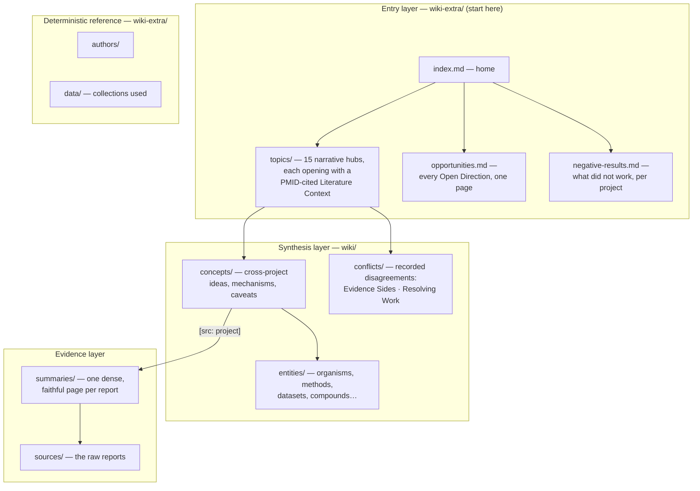

# Wiki architecture

The wiki is a layered synthesis over the BERIL Research Observatory's project
reports. Each layer answers a different reader question, and every factual
claim in the reader-facing layers carries a per-claim citation back to its
source project.

## Page types and their contracts

| Layer | Page type | Contract |
|---|---|---|
| `wiki/summaries/` | one per report | dense and faithful, exact numbers, every paragraph `[src:]`-tagged; ends with `## Slots Into` naming the concepts it feeds; includes null/negative results |
| `wiki/concepts/` | cross-project synthesis | argues *across* projects; typed relations in prose (**supports / contradicts / refines**); disagreements under `## Tensions`; ends with `## Open Directions` (data + method + question) |
| `wiki/entities/` | one per named thing | organisms, genes/pathways, compounds, methods, datasets, places, people; canonical name + aliases; single-source entities are hidden at publish until a second project cites them |
| `wiki-extra/topics/` | narrative hubs | the corpus argued as one story per topic; opens with `## Literature Context` (external, PMID-verified) |
| `wiki-extra/conflicts/` | promoted disagreements | `## Evidence Sides` (each side cited) and `## Resolving Work` (what would settle it) — never averaged away |
| `wiki-extra/` digests | opportunities, negative-results, authors, data | generated deterministically by code, no LLM |

## The citation grammar

- `[src: project_id]` ends every factual claim in summaries, concepts,
  entities, and hubs; ids are report filename stems (plus `discoveries` /
  `pitfalls` for the cross-project digests). `wiki_check.py` verifies every
  id resolves and every flagged number appears in a cited source.
- `[[wikilinks]]` connect pages (`[[concepts/x]]`, `[[summaries/y__REPORT]]`);
  targets are validated at write time, and links the corpus can't resolve are
  downgraded to plain text at publish, never shown broken.
- `## Literature Context` sections are the one exception to corpus-only
  citation: they cite external papers as `[PMID nnnn](pubmed url)`, verified
  against the actual PubMed query results at build time.

## Frontmatter (managed by code, never hand-edited)

Every `wiki/` page carries `type` (`Summary` / `Concept` / entity subtype),
`description` (one line, drives the index and plan prompts), and `sources`
(the summary pages whose evidence the page integrates — this list also powers
resume-skipping and the publish-time filters below).

## Publish-time transforms

`quartz_ingest.py` derives the reader site from the corpus without touching
it:

- `[src:]` tags become links to the summary pages; summaries link their raw
  reports ("Raw report:") and gain a deterministic **"Feeds into:"** line
  listing every concept that cites the project — a first, honest impact view.
- Entity pages citing only one source are omitted (they return automatically
  once a second project cites them); their links downgrade to plain text.
- Flagship figures chosen by the figures stage are spliced in from the
  observatory checkout; dead wikilinks are stripped.

## Reading model

Start at the **home page → a topic hub**: the Literature Context says where
the field stands, "What the Corpus Shows" argues the corpus's answer, and
"Where to Go Deeper" hands you concepts → summaries → raw reports, so every
claim is at most three hops from its evidence. `opportunities.md` is the
what-to-do-next surface; `negative-results.md` is what to check before
repeating an analysis.

## Ground rules

`wiki/` and `wiki-extra/` are **generated output — never hand-edit content**.
Editorial behavior is changed in `contract/AGENTS.md` (injected into every
compile call) or in the stage prompts; content changes flow from source
reports through the pipeline.
